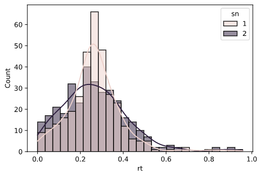
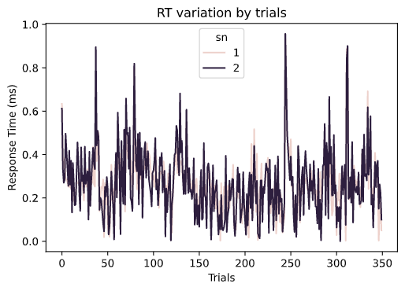
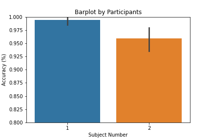

<!-- 5주차_시각화&통계분석.md -->
# Python Study 5주차: 시각화 & 통계 분석

## 데이터 시각화 
이번 글은 데이터 분석의 마지막 단계로 시각화와 통계 분석을 다룬다. 시각화는 matplotlib(맷플롯립)이라는 라이브러리를 기본적으로 사용하지만 그 외에 다른 사람들이 만들어놓은 다양한 라이브러리를 사용할 수 있다. matplotlib으로는 제한적이기 때문에 보통 seaborn까지는 기본적으로 사용한다.

<br/>

### 시각화할 데이터 준비
```python
# BASIC LIBRARIES & 
# DATA PROCESSING LIBRARIES
import os
import pandas as pd
import scipy.stats as stats

# LOAD DATA
files = os.listdir('data')
data = pd.DataFrame()

for file in files:
    # 데이터 불러오기
    tmp_data = pd.read_csv(f'data/{file}')

    # 결측값 제거
    tmp_data = tmp_data.dropna()
    
    # 참가자별 시행 수 표시
    tmp_data['trl'] = range(len(tmp_data))

    # rt를 기준으로 표준화
    tmp_data['zscore'] = stats.zscore(tmp_data['rt'])
    
    # 해당 참가자 데이터를 전체 데이터에 합치기
    data = pd.concat([data, tmp_data])

# 참가자 별로 rt 기준 2 표준편차 범위 이내 자료만
data = data[data['zscore'].between(-2,2)]
data.groupby('sn').describe()
```

위의 코드로 데이터를 준비해주자. 코드의 나머지 부분은 이전에 설명했던 내용이고 표준화 하는 부분만 추가되었다. `scipy.stats`를 사용해서 데이터프레임의 특정 열을 표준화하고 `df.between()`을 사용해서 원하는 범위의 값만을 추출할 수 있다. 결측값 제거와 표준화를 마치면 분석에 사용할 데이터의 준비는 끝난다.

<br/>

### matplotlib과 seaborn을 이용한 히스토그램
```python
# DATA VISUALIZATION LIBRARIES
import matplotlib.pyplot as plt
import seaborn as sns

# HISTOGRAM
sns.histplot(
    data=data,
    x='rt',
    hue='sn',
    kde=True
)
plt.show()
```


일단 시각화를 위한 라이브러리를 불러오자. `seaborn`은 `sns`라는 줄임말로 평범하게 불러오면 된다. `matplotlib`은 조금 특이한데 `matplotlib.pyplot`으로 따로 지정해서 불러온다. 줄임말은 보통 `plt`를 사용한다.

불러오고 난 다음에는 seaborn으로 그리고 matplotlib으로 화면에 표시한다. 히스토그램을 그리는 명령은 `sns.histplot()`이다. 히스토그램은 특정 변수의 분포를 시각적으로 나타낸 것이기 때문에 x축만 잘 지정해주자. 

`hue=` 옵션은 seaborn이 제공하는 편리한 기능 중 하나이다. hue에 원하는 구분 기준을 넣어주면 seaborn이 자동적으로 해당 기준에 따라 데이터를 나눠서 다른 색으로 칠해서 보여준다. 우리는 참가자 별로 히스토그램을 그리기 위해 `hue='sn'` 옵션을 주었다.

seaborn의 장점은 열 이름이 있는 데이터프레임을 입력으로 받을 수 있기 때문에 파라미터 옵션을 문자열로 간단하게 줄 수 있다는 것이다. seaborn으로 그림을 다 그린 뒤에는 `plt.show()` 명령으로 그림을 띄운다

<br/>

### 제목이 있는 선 그래프
```python
sns.lineplot(
    data=data,
    x='trl', 
    y='rt',
    hue='sn'
)
plt.title('RT variation by trials')
plt.xlabel('Trials')
plt.ylabel('Response Time (ms)')
plt.show()
```


seaborn은 matplotlib에 의존하며 데이터를 그래프로 바꾸는 역할 정도만 한다. 그래프의 세부적인 부분을 조절하려면 matplotlib의 설정을 건드려줘야 한다. 제목과 x축, y축의 표시를 변경하는 경우가 그렇다.

`plt.title(그래프 제목)` 명령으로 그래프의 제목을 손쉽게 바꿀 수 있다. 그래프 제목은 문자열로 넣어준다. x축과 y축 표시는 각각 `plt.xlabel()`과 `plt.ylabel()`로 바꾼다.

<br/>

### Y축 범위를 조절한 막대 그래프 저장하기
```python
# SAVING BARPLOT WITH LIMITED Y-AXIS
sns.barplot(
    data=data,
    x='sn',
    y='cor'
)
plt.title('Barplot by Participants')
plt.xlabel('Subject Number')
plt.ylabel('Accuracy (%)')
plt.ylim([0.8, 1.0])

plt.savefig('data/fig3.png')
plt.show()
```


여기서는 그래프 유형을 막대그래프로 바꾸는 것 외에 추가로 두 개를 해볼 것이다. 그래프에 표시되는 y축의 범위를 조절할 것이고 결과 그래프를 저장할 것이다. 

`plt.ylim([최소값, 최대값])`을 넣어주는 것으로 그래프에 표시되는 y축의 범위를 설정할 수 있다. 동일한 방법으로 x축의 범위도 지정할 수 있다. 완성한 그래프는 `plt.savefig('저장경로.확장자')`로 파일 형태로 저장할 수 있다. `plt.show()`를 하기 전에 저장하도록 하자. 그렇지 않으면 그래프를 이미 띄운 상태이기 때문에 하얀 화면만 저장된다.

<br/>

### 투명도를 조절한 산점도
```python
# SCATTERPLOT WITH OPACITY
sns.set_style('darkgrid')
sns.scatterplot(
    data=data,
    x='trl',
    y='rt',
    hue='sn',
    alpha=0.7
)
plt.savefig('data/fig4.png', dpi=300)
plt.show()
```
seaborn 함수의 `alpha=` 파라미터를 조절하면 그래프의 투명도를 조절할 수 있다. 

<br/>


## 통계 분석
### SCIPY를 이용한 통계분석
```python

# STATISTICAL ANALYSIS LIBRARIES
import scipy as sp
import scipy.stats as stats

# USING SCIPY
data1 = data[data['sn']==1]
data2 = data[data['sn']==2]

result1 = stats.ttest_1samp(data['rt'], popmean=0)
result2 = stats.ttest_ind(data1['rt'], data2['rt'].dropna())

print(result1)
print(result2)

```

<br/>


### STATSMODELS를 이용한 통계 분석
```python
import statsmodels.api as sm
import statsmodels.formula.api as smf

# USING STATSMODELS
model = smf.ols(
    data=data, 
    formula='rt ~ cor*sn'
)
result = model.fit()
help(result)
print(result.summary())
```

<br/>
